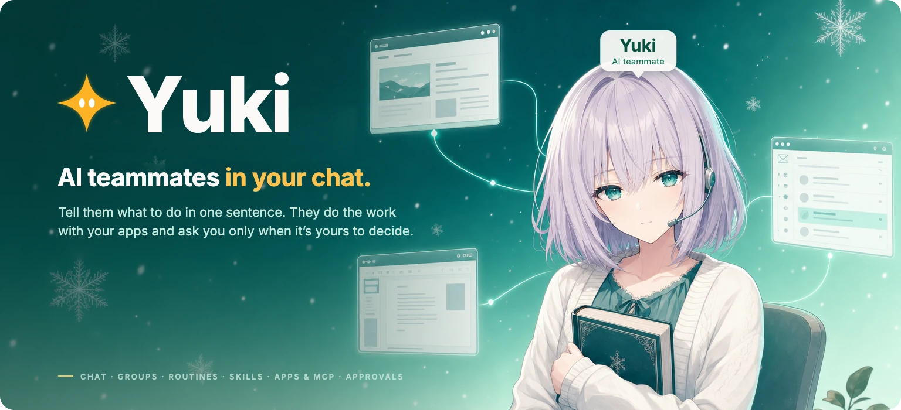

<p align="center">
  <a href="https://yukilab.si"></a>
</p>

<p align="center">
  <strong>English</strong> · <a href="README.zh-CN.md">简体中文</a>
</p>

<p align="center">
  <strong><a href="https://yukilab.si">Try it at yukilab.si</a></strong> &nbsp;·&nbsp; <a href="#quick-start">Run it yourself</a> &nbsp;·&nbsp; <a href="#what-yuki-does">What it does</a> &nbsp;·&nbsp; <a href="#core-and-hosted">Core and hosted</a>
</p>

Yuki is an **AI teammate that lives in a chat**. Open it and Yuki is already there: tell it what you need in one sentence. Add more teammates when you want help, put them in a group, and they hand work to each other in the open. When something needs a decision, they come to you; nothing goes out in your name until you say so.

This repository is Yuki's source-available core: single-user, running on your own machine, under the Yuki Community License.

<picture>
  <source media="(prefers-color-scheme: dark)" srcset="assets/yuki/chat-dark.svg">
  
</picture>

## What Yuki does

<table>
<tr>
<td width="50%" valign="top">

**Talk, don't configure**<br>
No setup forms. The first thing you say becomes the teammate's job; to change it, just say so.

</td>
<td width="50%" valign="top">

**Teammates and groups**<br>
Groups of 2 to 6. `@` a teammate, a group, a routine or an app. Handoffs happen in the conversation, where you can see them.

</td>
</tr>
<tr>
<td valign="top">

**Routines**<br>
"Every weekday at 9…" or "when an email arrives…". Pause, test and edit them on the teammate's card. A run with nothing new stays quiet.

</td>
<td valign="top">

**Skills**<br>
Save a way of working in one sentence, or have Yuki learn it from something it just did with you.

</td>
</tr>
<tr>
<td valign="top">

**Apps and MCP**<br>
Gmail, Google Calendar, your own mailbox, Slack, and any MCP server, including one running on your own machine. Connect once; every teammate can use it.

</td>
<td valign="top">

**You approve what matters**<br>
Allow once, always allow, or deny. Email and Slack messages are drafts until you press Send. Action review checks each step against your own rules.

</td>
</tr>
</table>

Conversations live in your own database (embedded PGlite, or your Postgres). Secrets are sealed with your own key and never shown to the model.

## Core and hosted

|  | Core (this repository) | [Hosted](https://yukilab.si) |
|:--|:--|:--|
| Chat, teammates, groups, routines, skills, apps, approvals | ✓ | ✓ |
| A computer for teammates to work on | ✓ its own container, on your machine | Coming: a cloud computer |
| Teams and shared spaces | — | Coming |

The engine still holds some code from an earlier design (desktop accounts) that the app no longer reaches; a coming release removes it.

---

## Quick start

Needs Node 22+ and pnpm 11, and an API key of a model provider (OpenAI, Anthropic or Google).

```sh
git clone https://github.com/caspianchan31/yuki.git
cd yuki
pnpm install
pnpm --dir apps/web install
cp .env.example .env
```

Two keys of your own, kept out of the repository:

```sh
mkdir -p ~/.yuki
openssl rand -base64 32 > ~/.yuki/credential.key && chmod 600 ~/.yuki/credential.key
openssl rand -base64 32   # paste it as TOKEN_ENCRYPTION_KEY below
```

In `.env`, set:

```sh
WORKSPACE_MODE=live
AGENT_BACKEND=model
MODEL=openai/gpt-5            # or anthropic/<model> or google/<model>
OPENAI_API_KEY=sk-...         # the key of that provider (ANTHROPIC_API_KEY, GOOGLE_API_KEY)
TOKEN_ENCRYPTION_KEY=...      # the value printed above
CREDENTIAL_KEY_FILE=/Users/you/.yuki/credential.key   # its full path
```

Start the API and the app, in two terminals:

```sh
pnpm dev                      # API on http://localhost:8787
pnpm --dir apps/web dev       # app on http://localhost:5173
```

Open http://localhost:5173. The first time, create your account with a username, a password and the setup code the API printed in its terminal. Then say hello to Yuki.

Without a model key, `cp .env.example .env` alone starts a sample workspace with made-up data and a scripted Yuki.

### Run it with docker compose, with a computer of its own

One command starts the Yuki service and a separate **computer** container where your teammates run commands, keep files and browse. They work only there, never on your machine; you can watch its screen live, take it over and hand it back, and it pauses itself when nobody uses it. Needs Docker with the Compose plugin and about 3 GB of free memory.

```sh
cp .env.example .env
# edit .env: MODEL, the provider's API key, OPENMUSE_ADMIN_USERNAME and OPENMUSE_ADMIN_PASSWORD
docker compose up -d --build   # then open http://localhost:8787
```

Memory limits, the port and the idle pause are settings in `.env`. Details, limits and where the data lives: [docs/computer-container.md](docs/computer-container.md).

### Connect apps

- **MCP servers**: 设置 (Settings) → 连接的应用 → 添加自定义 MCP 服务, with the server's address and, if it needs one, its access token. A server on your own machine or network (`http://localhost:…`) works too.
- **Your own mailbox**: ⌘K → 凭据 (Credentials) → 添加发信邮箱 (SMTP, and IMAP to read).
- **Gmail and Google Calendar**: create a Google OAuth web client, set `GOOGLE_CLIENT_ID` and `GOOGLE_CLIENT_SECRET`, and register `http://localhost:8787/api/google/callback` as its redirect URI.
- **Slack**: create your own Slack app and set `SLACK_CLIENT_ID` and `SLACK_CLIENT_SECRET`; the steps are just below.

<details>
<summary><b>Connect Slack, step by step</b></summary>

Slack needs an app of your own, made once. Then 设置 → 连接的应用 → Slack → 连接 takes you to Slack to allow it and brings you back, connected.

1. Open <https://api.slack.com/apps> → **Create New App** → **From scratch**; name it and pick your workspace.
2. **OAuth & Permissions** → **Redirect URLs** → add `<PUBLIC_API_URL>/api/slack/callback` (for a local install, `http://localhost:8787/api/slack/callback`) and save.
3. Same page → **Bot Token Scopes**, add: `channels:read`, `groups:read`, `channels:history`, `groups:history`, `users:read`, `chat:write`, `chat:write.public`.
4. **Basic Information** → copy the **Client ID** and **Client Secret** into `.env` as `SLACK_CLIENT_ID` and `SLACK_CLIENT_SECRET`. Make sure `TOKEN_ENCRYPTION_KEY` is set too, then restart.
5. In Slack, invite the app to each channel it should read (`/invite @your-app`); it can only read channels it is in. Teammates read and draft; a message goes out only when you press Send.

</details>

## License

[Yuki Community License 1.0](LICENSE): use it, change it and run it for yourself or inside your organization; offering it to others as a hosted service is not allowed. Each version becomes MIT two years after it is published. Third-party notices: [THIRD_PARTY_NOTICES.md](THIRD_PARTY_NOTICES.md).
